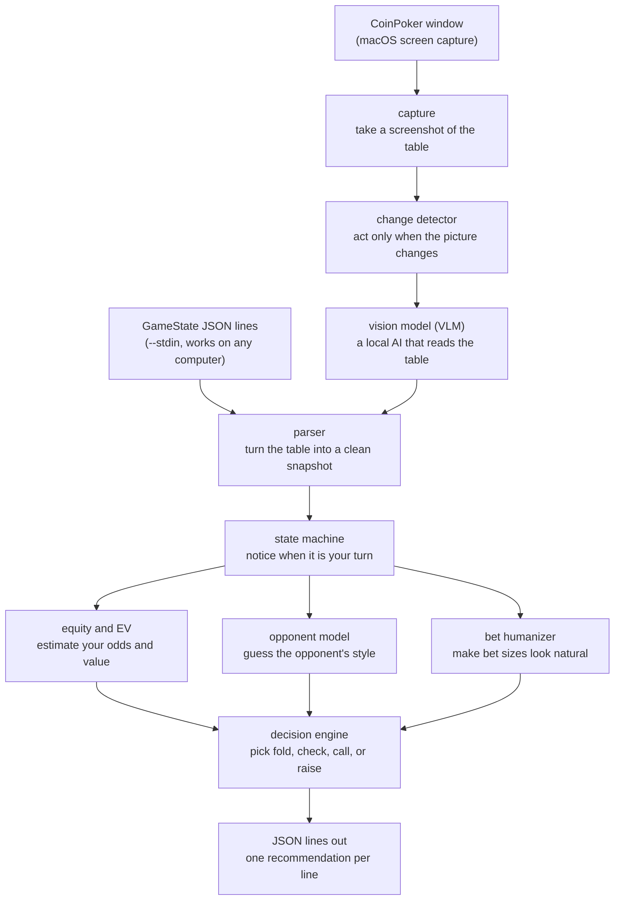

# coinpoker-help

An experimental tool that helps a person study poker decisions. It watches a
poker table (or reads a description of one), works out the odds and the best
move, and prints a suggestion. It is a study aid — it never clicks, types, or
controls the game for you.

You are responsible for following the law, the rules of any platform you use,
and the licenses of any models you download.

## What it does, in one picture



In plain words: the program turns a poker table into a clean description, works
out your chances of winning, and suggests whether to fold, check, call, or
raise. You can feed it a table description directly, or (on a supported Mac) let
it take a screenshot and have a local AI read the picture for you.

## The building blocks

The code is split into small pieces, each with one job:

| Piece | What it does |
| --- | --- |
| `ingest` | Turns the real world into data: screenshots, noticing changes, asking the vision model to read the table, and turning the answer into a clean description. |
| `core-engine` | The math: pot odds, the chance your hand wins, and the expected value of each move. |
| `ghost-layer` | Makes the computer's choices look human: realistic bet sizes and timing. |
| `opponent-model` | Keeps stats on opponents and guesses their playing style. |
| `ui` | Formats the final suggestion as JSON lines (and has an optional, unfinished desktop window). |
| `bin` | The `coinpoker` command-line program that wires everything together. |

## What you need

- Rust 1.95 or newer (the exact version is pinned so everyone builds the same way).
- The `--stdin` mode works on Windows, Linux, and macOS.
- Live screen capture needs macOS 14 or newer, permission to record the screen,
  and a visible CoinPoker window.
- The "read the table with AI" mode needs a suitable Apple Silicon Mac and a
  separate local AI server running in the background.

The project's automatic checks run on Windows, Linux, and macOS. They do not
open a real game window or record a real screen — those parts are tested by a
person on a Mac.

## How to run it

```bash
# Watch a live game on macOS and print suggestions
cargo run --release --bin coinpoker

# Read table descriptions from a file or pipe (works anywhere)
cargo run --release --bin coinpoker -- --stdin

# List the windows available to capture (macOS)
cargo run --release --bin coinpoker -- --list-windows

# See all options
cargo run --release --bin coinpoker -- --help
```

The `--ui` option is recognized but not finished yet, so it exits with an
error. Use the JSON-lines output instead.

## How the vision mode works (and a privacy note)

In live mode, the program takes a full picture of the CoinPoker window. When the
picture changes, it sends that picture to an AI that reads the table and
describes it. By default the AI runs on your own computer at:

```text
http://127.0.0.1:8080/v1/chat/completions
```

Screenshots are private. For that reason the program refuses to send them
anywhere except your own computer unless you take two deliberate steps: set
`COINPOKER_ALLOW_REMOTE_VLM=1` **and** point `COINPOKER_VLM_ENDPOINT` at an
HTTPS address you trust. Only do this if you understand that it can expose what
is on your screen.

The project does not download or start the AI server for you. You need a server
that supports the Gemma 4 vision model and the image format this program sends.

## Settings

| Setting | Default | What it does |
| --- | --- | --- |
| `COINPOKER_WINDOW_TITLE` | `CoinPoker` | Text used to find the right window |
| `COINPOKER_APP_NAME` | `CoinPoker` | App name used as a fallback match |
| `COINPOKER_VLM_ENDPOINT` | `http://127.0.0.1:8080/v1/chat/completions` | Where to send screenshots in live mode |
| `COINPOKER_VLM_MODEL` | `gemma-4-e2b-it-OptiQ-4bit` | Model name sent to the AI server |
| `COINPOKER_ALLOW_REMOTE_VLM` | unset | Set to `1` or `true` to allow sending screenshots to another computer |

Empty values are ignored.

## Downloading the model

The script `download-model.sh` downloads the AI model into the `models/` folder,
checks that all the files arrived correctly, and writes down exactly which
version it downloaded.

```bash
./download-model.sh          # E2B OptiQ
./download-model.sh e4b      # E4B OptiQ
./download-model.sh e2b-qat  # E2B QAT OptiQ
```

The download is large (about 5–7 GB). The script needs Bash, Python 3, and
ideally the `hf` tool.

| Variant | Revision | Terms |
| --- | --- | --- |
| E2B | `ffcf5c056bdd0df50627867ee8c7cba890eabe33` | Gemma Terms of Use |
| E4B | `e1404a83551b6eb571dc5fb0de93e52310399bcd` | Gemma Terms of Use |
| E2B QAT | `c6c6572580501e5fcb9248bf12040d25cfc71118` | Treat as Gemma terms pending clarification |

Read `MODEL_LICENSES.md` before downloading or using any weights. The MIT
license covers this project's source code only — not the models.

## Feeding it a table by hand

In `--stdin` mode, each line is one description of a table. It must be valid
JSON with the required fields. Here is a flop example:

```json
{"game_phase":"flop","hero_cards":[{"rank":"A","suit":"spades"},{"rank":"K","suit":"hearts"}],"board":[{"rank":"A","suit":"diamonds"},{"rank":"7","suit":"clubs"},{"rank":"2","suit":"spades"}],"pot_size":1000,"to_call":500,"hero_chips":5000,"min_raise_to":1500,"max_raise_to":5000,"players":[{"name":"Hero","chips":5000,"last_action":"check","bet_amount":0},{"name":"Villain","chips":4500,"last_action":"bet","bet_amount":500}],"action_required":true,"available_actions":["fold","call","raise"]}
```

If a line is wrong or incomplete, the program skips it and prints a warning.

## How we keep the code healthy

Before any change is accepted, automated checks must pass. Run them all at once
with one command (you need [just](https://github.com/casey/just) for this
shortcut):

```bash
just validate
```

Without `just`, run the checks one at a time:

```bash
cargo fmt --all -- --check                                     # is the formatting tidy?
cargo check --workspace --all-targets --all-features --locked  # does it compile?
cargo test --workspace --all-targets --all-features --locked   # do the tests pass?
cargo clippy --workspace --all-targets --all-features --locked -- -D warnings  # does it follow best practices?
cargo test --doc --workspace --all-features --locked           # do the examples in the docs work?
bash -n download-model.sh                                      # is the download script written safely?
```

Three kinds of tests keep the math honest:

- **Rule tests** try thousands of random situations and check that the rules
  always hold.
- **Snapshot tests** save a copy of what the program produces, so any
  unexpected change is obvious.
- **End-to-end tests** run the finished program and check its real output.

We also measure how much of the code the tests actually exercise. At least
**80%** must be covered, or the change is rejected. Finally, we check that our
dependencies have no known security problems:

```bash
cargo audit --locked   # needs the cargo-audit tool installed
```

See `CONTRIBUTING.md` for how to contribute and `SECURITY.md` for how to report
problems privately.

## What is not done yet

- There is no finished desktop window; the `--ui` option does not open one.
- Stats on opponents are not yet connected, so everyone is treated as
  "unknown."
- Some advanced poker situations are not modeled yet, such as side pots in
  multi-way all-ins and ranges based on position and betting history.
- The "human-like timing" feature exists but is not yet used in the live
  pipeline.
- The program only makes suggestions. It never plays for you.

## What might come next

- Learn from hands you have already played.
- Finish the optional desktop window.
- Add a WebSocket connection for other programs to subscribe to.

## License

The source code is licensed under the MIT License. See `LICENSE`. Downloaded
models have their own terms, described in `MODEL_LICENSES.md`.
